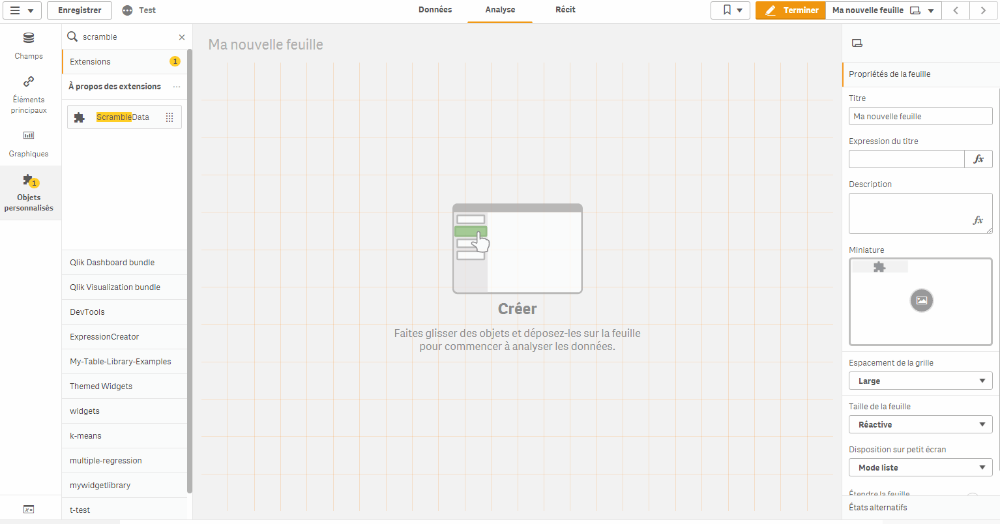

# QlikSense-ScrambleData-Button

Scramble the data of many fields, directly in the app by a button.

**Author:** Baptiste Durand

**License**: MIT Licensed  

# Disclaimer

Created for a personal use.
This is NOT A QLIK PRODUCT. This is not supported.
No warranty, use at your own risks.
Not Documented.

# Use case
In QlikView an option allow to scramble the data of many fields.
This features is available in Qlik Sense through the Dev-Hub, field by field.
This extension allows to execute the scrambling of many fields in a app by a button.

# Example

How can I use it?

# How it works

Specify which fields you want to scramble by selecting them in $Field technical field (it contains all fields of the app).
It is possible to modify the selection option through the properties panel (Selected, Excluded, Possible values, etc).

## Information :
Processing time depends on the number of unique values.

For more information about Scrambling method :
https://help.qlik.com/en-US/sense-developer/November2019/APIs/EngineAPI/services-Doc-Scramble.html

Some properties are retained to help debugging. For example, special characters are not changed, and small numbers are scrambled to another small number.

# Pre-requisite

Qlik Sense >=3

